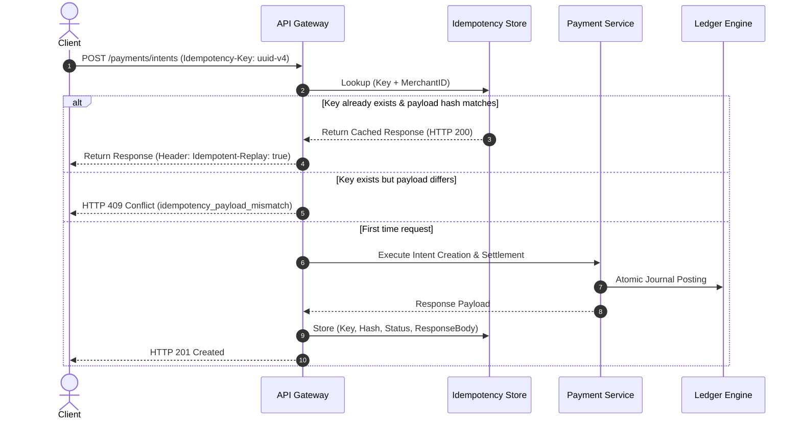

# PayNexa Architecture & Engineering Deep-Dive

## 1. Double-Entry Bookkeeping Ledger Engine

PayNexa implements an immutable, append-only double-entry bookkeeping ledger following the fundamental accounting equation:

$$\text{Assets} = \text{Liabilities} + \text{Equity} + (\text{Revenue} - \text{Expenses})$$

### Account Normal Balances

| Account Type | Category Examples | Normal Balance | Increase Condition | Decrease Condition |
| :--- | :--- | :--- | :--- | :--- |
| **`ASSET`** | Platform Reserve, Scheme Clearing | **DEBIT** | `DEBIT` (+) | `CREDIT` (-) |
| **`LIABILITY`** | Merchant Settlement, Customer Wallet | **CREDIT** | `CREDIT` (+) | `DEBIT` (-) |
| **`EQUITY`** | Retained Earnings, Founder Capital | **CREDIT** | `CREDIT` (+) | `DEBIT` (-) |
| **`REVENUE`** | Processing Fees, FX Spread Margin | **CREDIT** | `CREDIT` (+) | `DEBIT` (-) |
| **`EXPENSE`** | Scheme Interchange, Chargeback Loss | **DEBIT** | `DEBIT` (+) | `CREDIT` (-) |

### Invariance Rule
For every journal entry $J$:
$$\sum_{p \in J.postings, p.dir = \text{DEBIT}} p.amount = \sum_{p \in J.postings, p.dir = \text{CREDIT}} p.amount$$

If any posting violates this rule, the entire database transaction is immediately rolled back without persisting state.

---

## 2. Idempotency & Distributed Locking

To prevent duplicate charges across unstable networks (e.g. mobile checkout dropped connections), PayNexa provides RFC-compliant `Idempotency-Key` tracking:

---

## 3. Real-Time Fraud Scorecard & Risk Pipeline

Each transaction undergoes synchronous heuristic evaluation before scheme capture:

1. **Blacklist Filter**: Matches IP, email domain, card fingerprint, or BIN prefix.
2. **Velocity Counter**: Evaluates frequency and volume in moving 300-second windows.
3. **Geo Anomaly**: Flags mismatches between IP origin country and card issuing country.
4. **Amount Spike**: Triggers step-up authentication on excessive values.
5. **Decision Scoring**:
   - $0 \le \text{Score} < 40$: `APPROVE` (Frictionless flow)
   - $40 \le \text{Score} < 75$: `CHALLENGE_3DS` (OTP required)
   - $75 \le \text{Score} < 85$: `MANUAL_REVIEW` (Compliance queue)
   - $85 \le \text{Score} \le 100$: `DECLINE` (Hard block)

---

## 4. Webhook Reliability & HMAC Signatures

All outbound events include an HMAC-SHA256 signature in the `PayNexa-Signature` header:

$$\text{Signature} = \text{HMAC-SHA256}(\text{key}=\text{secret}, \text{data}=\text{timestamp} + "." + \text{payload})$$

Failed deliveries trigger exponential backoff:
$$\text{Delay}(n) = 2^n \times 1000\text{ms} \quad (n \in [1, 5])$$
