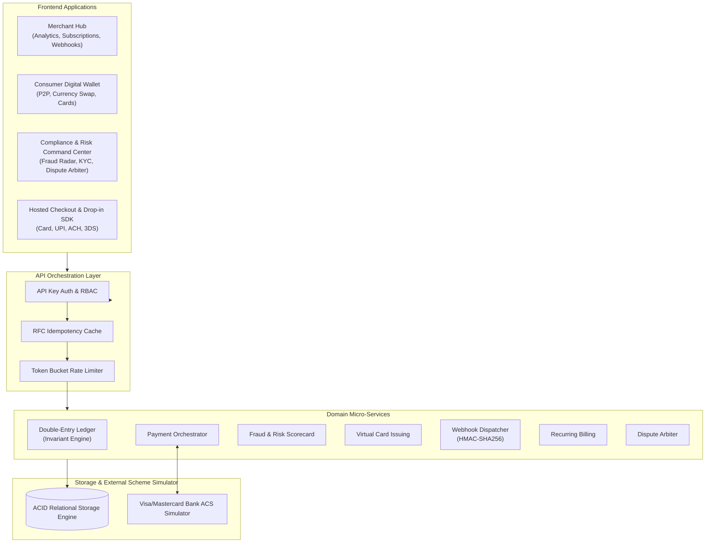

# PayNexa — Next-Generation Digital Payment Platform & Core Banking Engine

[](https://github.com/LingamalluRitesh/PayNexa/actions)
[](https://opensource.org/licenses/MIT)
[](https://www.typescriptlang.org/)
[](https://react.dev/)
[](https://tailwindcss.com/)

PayNexa is an enterprise-grade digital payment orchestration engine, multi-currency ledger, and core banking infrastructure. It provides bank-grade double-entry bookkeeping, real-time fraud scoring, virtual card issuance, subscription billing, resilient webhook dispatching, and an interactive developer suite.

---

## 🌟 Key Architectural Capabilities

### 1. Core Double-Entry Ledger Bookkeeper
- **Mathematical Invariance Guarantee**: Enforces $\sum \text{Debits} \equiv \sum \text{Credits}$ for every single journal entry.
- **Account Classifications**: Native support for `ASSET`, `LIABILITY`, `EQUITY`, `REVENUE`, and `EXPENSE` normal balances.
- **Atomic Balance Holds**: Real-time reservations for card pre-authorizations, dispute escrows, and in-transit payouts.
- **Multi-Currency FX Engine**: Instant liquidity exchange across `USD`, `EUR`, `GBP`, `JPY`, `INR`, `CAD`, `AUD`, and `SGD`.

### 2. Payment Gateway & Checkout Engine
- **Payment Intent State Machine**: `CREATED` $\to$ `REQUIRES_ACTION` $\to$ `PROCESSING` $\to$ `SUCCEEDED` / `FAILED`.
- **Payment Methods**: Credit/Debit Cards (Visa, Mastercard, AMEX), Instant UPI with QR generation, and ACH / SEPA Bank Wire.
- **3D Secure 2.2 ACS Simulation**: Frictionless and challenge-mandated Strong Customer Authentication (SCA).
- **Full & Partial Refunds**: Automated proportional platform fee reversals and ledger adjustments.

### 3. Real-Time Risk & Fraud Scorecard
- **Velocity Engine**: Moving time-window transaction counters & volume aggregations.
- **Geographical Anomaly Detection**: Cross-border client IP origin vs. card BIN issuing country mismatch.
- **Dynamic Rule Management**: Custom threshold rules with instant policy enforcement (`APPROVE`, `CHALLENGE_3DS`, `MANUAL_REVIEW`, `DECLINE`).
- **Global Blacklist**: Instant blacklisting on suspect IPs, emails, card fingerprints, and BINs.

### 4. Virtual Card Issuing & Spending Controls
- **Luhn-Compliant Generation**: Automated PAN, CVV, and expiration calculation.
- **Granular Spending Limits**: Per-transaction, daily, and monthly limits with live enforcement.
- **Form Factors**: General purpose cards and single-use self-terminating "burn" cards.
- **Instant Freeze / Unfreeze**: One-click card status toggle.

### 5. Resilient Webhook Dispatcher
- **Cryptographic Signatures**: HMAC-SHA256 headers (`PayNexa-Signature: t=...,v1=...`) with replay protection.
- **Exponential Backoff**: Automated retry policy ($2^n \times 1\text{s}$) with dead-letter status logging.
- **Manual Replay**: 1-click test ping and retry replay directly from the merchant dashboard.

---

## 🏛️ System Architecture



---

## 📁 Repository Structure

```
├── packages/
│   ├── core/                    # Shared types, math utils, Luhn validator, HMAC crypto
│   ├── sdk-typescript/          # Official TypeScript/JavaScript SDK
│   └── sdk-python/              # Official Python SDK
├── server/                      # Core Banking & API Server (Node.js/Express/WebSocket)
│   ├── src/
│   │   ├── config/              # Typed environment loader (Zod)
│   │   ├── database/            # ACID storage engine, schema, and seed data
│   │   ├── services/            # Ledger, Payment, Fraud, Card, Webhook, Dispute services
│   │   ├── controllers/         # REST API Controllers
│   │   ├── middleware/          # Auth, Idempotency, Rate Limit, Error Logger
│   │   └── websocket/           # Real-time WebSocket Gateway
│   └── src/tests/               # Automated invariant & integration test suites
├── client/                      # Next-Gen React 19 + Tailwind CSS Frontend
│   └── src/
│       ├── components/          # 3D Virtual Card, 3DS Modal, Stat Cards, Badges
│       ├── views/               # Merchant, Consumer, Risk Admin, Checkout, Docs views
│       ├── services/            # Frontend API client
│       └── context/             # Global App State & WebSocket synchronizer
├── docs/                        # Architecture Decision Records (ADRs) & Compliance Specs
└── scripts/                     # Benchmark stress testing and seed generator
```

---

## 🚀 Quick Start Guide

### Prerequisites
- Node.js `v18+` (Tested on `v24.x`)
- npm `v9+`

### 1. Installation
Install all workspace dependencies:
```bash
npm install
```

### 2. Build Workspace
Build the shared core and SDKs:
```bash
npm run build
```

### 3. Run Development Servers
Start backend API server (`localhost:4000`) and Vite frontend (`localhost:5173`) concurrently:
```bash
npm run dev
```

### 4. Run Automated Test Suites
```bash
npm test
```

### 5. Run Concurrency Benchmark
Stress test double-entry ledger invariance and payment processing throughput:
```bash
npm run benchmark
```

---

## 🔒 Security & Zero-Secret Policy
- **No `.env` Secrets in Git**: Sensitive configuration files are strictly ignored in `.gitignore`.
- Safe zero-config development fallbacks are built into `server/src/config/index.ts`.
- All API keys stored in database are hashed with SHA-256 (`keyHash`).

---

## 📜 License
Released under the [MIT License](LICENSE).
Created with precision by Lingamallu Ritesh & the PayNexa Engineering Team.
